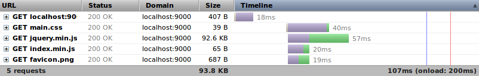
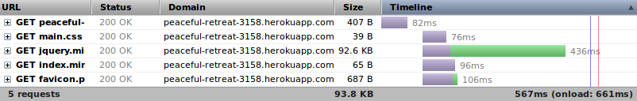
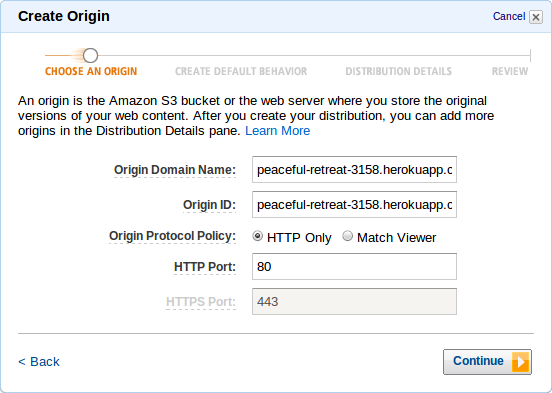
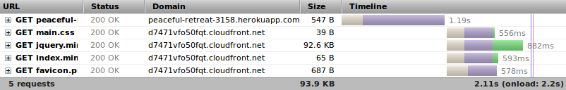
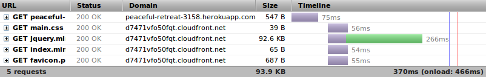

Play 2 with CloudFront
----------------------

Web applications are primarly comprised of data, services, and the User Interface (UI).  The UI is comprised of HTML, CSS, Images, and probably JavaScript.  In the traditional web architeture all of those assets are static files except the HTML which is dynamically generated by the server.  In the modern web architecture the entire UI is static files that consume RESTful / JSON services.  Of-course the static files for the UI must be downloaded to the client so the less time it takes for them to be downloaded, the better the overall performance.

Bits are moved around the world through beams of light (fiber optics).  Unfortunately the speed of light just isn't fast enough when it comes to transferring data around the world.  It takes 134ms for light to travel once around the world.  Think of all the light and bits that had to move from the Eastern United States (where this article is being served from) to you.  Some of the time you spent waiting for the content to load was purely in the moving of bits over long distances.  There is an obvious reason why physically moving bits closer to the consumer has massive performance benefits.

It would be amazing if a web application could just live right down the street from every user of the application.  But doing so would cause there to be many copies of the data, services and UI for an application.  The data usually needs to be consistent across all of the users of the application.  Maintaining a geo-distributed and consistent data set is a really hard thing to do without massive data syncronization overhead.  The services are just the gateway to the data so they need to be near the data.  But the UI, all of those static assets, can easily live in many places so they are located near the consumers.

This is exactly what a Content Delivery Network (CDN) does.  Also known as "edge caching", a CDN takes copies of static files and replicates them to servers around the world so that whenever someone downloads a static file the bits don't have to transfer across large distances.

It has often been a big hassle to geo-distibute / edge cache the static assets in a web application.  The typical setups for utilizing a CDN involve complex deployment proceedures and brittle architectures.  But the value of edge caching the static assets is emmense for any size web application.  The most effective way to improve the overall performance of just about every web application is to use a CDN.

Lets walk through how you can use Amazon [CloudFront CDN](http://aws.amazon.com/cloudfront/), [Heroku](http://www.heroku.com/), and [Play 2](http://www.playframework.org/) to transparently edge cache static assets.  Feel free to follow along.

## Create a Play 2 App

Create a new Play 2 application:

1. [Install Play 2](http://www.playframework.org/documentation/2.0.2/Installing)
2. Create a new app from the command line:

        play new play2-cloudfront

3. Confirm the app name and select `3` for an empty project:

        jamesw@T420s:~/Desktop$ play new play2-cloudfront
               _            _ 
         _ __ | | __ _ _  _| |
        | '_ \| |/ _' | || |_|
        |  __/|_|\____|\__ (_)
        |_|            |__/ 
                     
        play! 2.0.3, http://www.playframework.org
        
        The new application will be created in /home/jamesw/Desktop/play2-cloudfront
        
        What is the application name? 
        > play2-cloudfront
        
        Which template do you want to use for this new application? 
        
          1 - Create a simple Scala application
          2 - Create a simple Java application
          3 - Create an empty project
        
        > 3
        
        OK, application play2-cloudfront is created.
        
        Have fun!

For this example we are going to load jQuery from a [WebJar](http://www.jamesward.com/2012/04/25/introducing-webjars-web-libraries-as-managed-dependencies) so you can remove the `play2-cloudfront/public/javascripts/jquery-1.7.1.min.js` file.  Now update the `play2-cloudfront/project/Build.scala` file to include a dependency on the jQuery WebJar and the WebJars repository:

        import sbt._
        import Keys._
        import PlayProject._
        
        object ApplicationBuild extends Build {
        
            val appName         = "play2-cloudfront"
            val appVersion      = "1.0-SNAPSHOT"
        
            val appDependencies = Seq(
              "com.jquery" % "jquery" % "1.7.2-1"
            )
        
            val main = PlayProject(appName, appVersion, appDependencies, mainLang = JAVA).settings(
              resolvers += "webjars" at "http://webjars.github.com/m2"
            )
        
        }

If you want to use IntelliJ IDEA or Eclipse then you can generate the project files.  From the command line within the `play2-cloudfront` directory, run either:

        play idea

Or:

        play eclipsify

You can now start the Play server from the command line within the `play2-cloudfront` directory:

        play ~run

You can verify that the Play server is running by opening the local documentation in your browser: [http://localhost:9000/@documentation]

Play has a simple static asset controller that serves files from the classpath (any Jar dependency or source directory).  However, the [Assets Controller](http://www.playframework.org/documentation/api/2.0.2/scala/index.html#controllers.Assets$) doesn't provide a mechanism in it URL resolver (Play 2's reverse routing) to change the URL of the asset.  We will need this later since loading assets from CloudFront requires using a different, non-relative, domain name.  To solve this we will create a new `RemoteAssets` controller that wraps the `Assets` controller that optionally adds a domain prefix in front of the resolved URLs.

Create a new file named `app/controllers/RemoteAssets.scala` that contains:

        package controllers
        
        import play.api.mvc._
        import play.api.Play
        import play.api.Play.current
        import org.joda.time.format.{DateTimeFormat, DateTimeFormatter}
        import org.joda.time.DateTimeZone
        import scala.Some
        
        
        object RemoteAssets extends Controller {
        
          private val timeZoneCode = "GMT"
        
          private val df: DateTimeFormatter =
            DateTimeFormat.forPattern("EEE, dd MMM yyyy HH:mm:ss '"+timeZoneCode+"'").withLocale(java.util.Locale.ENGLISH).withZone(DateTimeZone.forID(timeZoneCode))
        
          type ResultWithHeaders = Result { def withHeaders(headers: (String, String)*): Result }
        
          def getAsset(path: String, file: String): Action[AnyContent] = Action { request =>
            val action = Assets.at(path, file)
            val result = action.apply(request)
            val resultWithHeaders = result.asInstanceOf[ResultWithHeaders]
            resultWithHeaders.withHeaders(DATE -> df.print({new java.util.Date}.getTime))
          }
        
          def getUrl(file: String) = {
            Play.configuration.getString("contenturl") match {
              case Some(contentUrl) => contentUrl + controllers.routes.RemoteAssets.getAsset(file).url
              case None => controllers.routes.RemoteAssets.getAsset(file)
            }
          }
        
        }

This Scala class has a `getAsset` method that takes `path` and `file` parameters and returns the actual asset in the response.  A `Date` header is also added to the response headers.  The `getUrl` method takes a `file` parameter and returns a URL to the file.  That URL will be prefixed by a `contentUrl` if one is provided in the application's configuration.  To setup the configuration so that an `contentUrl` can be optionally provided, add the following to the `conf/application.conf` file:

        contenturl=${?CONTENT_URL}

If an environment variable named `CONTENT_URL` is provided then the `contenturl` configuration parameter is set.

Now lets create and use some static content.  First lets write a little [CoffeeScript](http://jashkenas.github.com/coffee-script/) that will use jQuery to fade an image in.  This will help to illustrate how even compiled and minimized assets can be loaded from the CDN.  Create a new file named `app/assets/javascripts/index.coffee` containing:

        $ ->
          $("img").fadeIn()

This simple script simply fades in all of the images on the page when the page has loaded.

Also update the `public/stylesheets/main.css` file to give the web page a new background color:

        body {
            background-color: #ddddff;
        }

Now create a new server-side template that will load the stylesheet, jQuery (from the WebJar), the `index.coffee` script, and the `public/images/favicon.png` image.  Create a new file named `app/views/index.scala.html` containing:

        <!DOCTYPE html>
        <html>
        <head>
            <title>Play 2 with CloudFront</title>
            <link type='text/css' rel='stylesheet' href='@RemoteAssets.getUrl("stylesheets/main.css")'/>
            
            
        </head>
        <body>
            
        </body>
        </html>

Notice how the `getUrl` method in the `RemoteAssets` controller is used to get a URL for each asset.  Now we need a simple controller that will render the `index` template.  Create a new file named `app/controllers/Application.java` containing:

        package controllers;
        
        
        import play.mvc.Controller;
        import play.mvc.Result;
        
        import views.html.index;
        
        public class Application extends Controller {
          
          public static Result index() {
            return ok(index.render());
          }
          
        }

This controller has a single method named `index` that just returns the rendered `index` template with a `200` HTTP status.

The last thing to do is to create a mapping between HTTP request verbs & paths and the controller that serves the request.  Edit the `conf/routes` file and add the following:

        # Home page
        GET     /                           controllers.Application.index()
        
        # Map static resources from the /public folder to the /assets URL path
        GET     /assets/*file               controllers.RemoteAssets.getAsset(path="/public", file)

Now `GET` requests to `/` will be handled by the `controllers.Application.index` method and `GET` requests to `/assets/` will be handled by the `controllers.RemoteAssets.getAsset` method.

This simple little application is now ready for local testing.  Open it in your browser: [http://localhost:9000]

You should see the Play logo fade in on top of a purple-ish background.  This page required a total of five HTTP requests:

Lets take this application and deploy it on the cloud with Heroku and then we will setup CloudFront to serve the static assets.

## Deploy on Heroku

Heroku is a Cloud Application Platform that can run many different types of apps.  To deploy this application on Heroku:

1. [Signup for a Heroku Account](http://heroku.com/signup)

    Note: These instructions will not use Heroku beyond the [free tier](https://devcenter.heroku.com/articles/how-much-does-a-dyno-cost).

2. [Install Git](http://git-scm.com/download) (Or use Git from your IDE)
3. [Install the Heroku Toolbelt](https://toolbelt.herokuapp.com/)
4. Login to Heroku from the command line:

        heroku login

    If this is your first time using the Heroku Toolbelt then you will be led through the steps to associate an SSH key with your Heroku account.  This SSH key will be used to authenticate your uploads via Git.

5. From the command line in your `play2-cloudfront` directory, create a new Git repository, add your files to it, and commit them:

        git init
        git add app conf project public
        git commit -m init

6. From the command line in your `play2-cloudfront` directory, provision a new application on Heroku:

        heroku create

    This will create a new application with corresponding HTTP and Git endpoints, like:
    
        Creating peaceful-retreat-3158... done, stack is cedar
        http://peaceful-retreat-3158.herokuapp.com/ | git@heroku.com:peaceful-retreat-3158.git
        Git remote heroku added

7. To deploy your application on Heroku simply upload your Git repository to Heroku:
 
        git push heroku master

    This will push the `master` branch of your Git repository to the Git remote named `heroku` which in my case points to the `git@heroku.com:peaceful-retreat-3158.git` URL.  When Heroku recieves the files it will run the project build (SBT for Play 2 projects), then deploy and run the application.  When the application is running you can access it in your browser:
      
        heroku open

This time all five requests go to Heroku:

The requests take quite a bit longer than locally, in-part because the bits have a much larger distance to travel.  All of the requests except the index page (because it's dynamic) can be served from a CDN.  Now lets setup CloudFront to serve the static assets.

## Serve Static Assets with CloudFront

CloudFront has a very simple way to load static assets into it's CDN.  When a request comes into CloudFront, if the asset is not on the CDN or has expired, then CloudFront can get the asset from an "origin server".  The application you just deployed on Heroku will now be the origin server for the static assets.  To setup a new CloudFront "Distribution":

1. [Signup for a AWS Account](https://portal.aws.amazon.com/gp/aws/developer/registration/index.html)

    Note: CloudFront does not have a free tier.  So following these instructions will [cost you a tiny bit](http://aws.amazon.com/cloudfront/#pricing).

2. Open the [CloudFront Management Console](https://console.aws.amazon.com/cloudfront/home)
3. Select `Create Distribution`
4. Leave `Download` selected as the `delivery method` and select `Continue`
5. In the `Origin Domain Name` field enter the domain name for your application on Heroku.  In my case it is: `peaceful-retreat-3158.herokuapp.com`
6. Keep the other default values as-is and select `Continue`

    

7. Do the same for the next two steps (keep the defaults)
8. Select `Create Distribution`

It will now take about ten minutes for AWS to create the CloudFront distribution.  You can monitor the status in the AWS Console.  While you wait, take note of the domain name provided for your distribution.  Mine is: `d7471vfo50fqt.cloudfront.net`

You can test the status of distribution by making a request for the `favicon.png` file.  In my case the full URL is: [http://d7471vfo50fqt.cloudfront.net/assets/images/favicon.png]

The first time that request goes through, CloudFront will make a request back to the app on Heroku and then load the asset into the CDN.  If you examine the HTTP response headers on that request you will see:
 
        X-Cache:Miss from cloudfront

That indicates that the resource was not on the CDN.  A subsequent request should contain the following response header:

        X-Cache:Hit from cloudfront

That indicates that the resource was served from the CDN and there was no need to go back to the origin server.

Now that the static assets are loadable via CloudFront lets tell the app on Heroku and the `RemoteAssets` controller to point to them.  Just set the `CONTENT_URL` environment variable on your application by running the following from the command line (make sure you replace the URL value with the one for the distribution you just created):

        heroku config:add CONTENT_URL="http://d7471vfo50fqt.cloudfront.net"

Now test out your application on Heroku in your browser:

        heroku open

You should now see all four static asset requests going to CloudFront:

But as you can see they assets didn't load very quickly because the first request is a `Miss from cloudfront`.  Reload the page (clear your cache to avoid 304s) and you should see much faster responses:

And now your static assets are being edge cached!

## Learn More

Using a CDN is step one of significantly speeding up your web applications but there is certainly more that you can do.  By default Play sets the expiration time of static assets to 1 hour (via the `Cache-Control` response header:

    Cache-Control: max-age=3600

You can change that value by modifying the `application.conf` file ([more details](http://www.playframework.org/documentation/2.0/Assets)).  Often times you will also want to use [far future expires](http://developer.yahoo.com/performance/rules.html/rules.html#expires) and use naming conventions to instruct the client to fetch a new version of a static asset.

[Grab the source for this example](https://github.com/jamesward/play2-cloudfront).

[Check out the live demo](http://play2-cloudfront.herokuapp.com/).

Let me know if you have any questions.